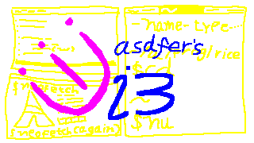

# asdfer's i3
Forked [i3](https://github.com/i3/i3) to add minor features to my taste.

Automated Testing has been ignored because I don't know Perl.

**Modifications:**
- Force kill window
- Decoration margins as a config (I found 4 pixels was the default)
- Alternating window decoration colors
